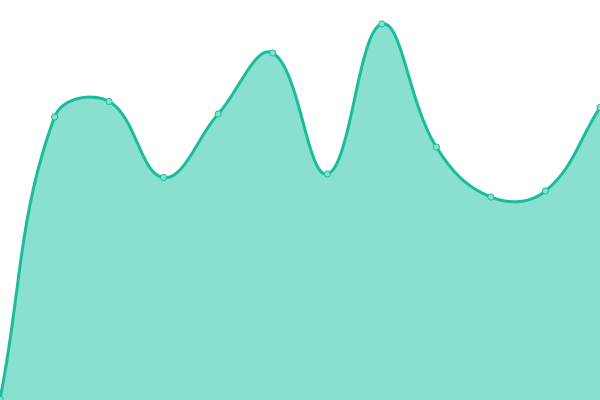
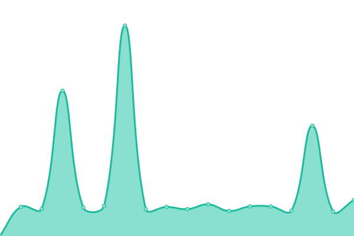

# [📈 Live Status](https://7hanw1n.github.io/uptime): <!--live status--> **🟧 Partial outage**

This repository contains the open-source uptime monitor and status page for [7w1n](https://7hanw1n.github.io/uptime), powered by [Upptime](https://github.com/upptime/upptime).

<!--start: status pages-->
<!-- This summary is generated by Upptime (https://github.com/upptime/upptime) -->
<!-- Do not edit this manually, your changes will be overwritten -->
<!-- prettier-ignore -->
| URL | Status | History | Response Time | Uptime |
| --- | ------ | ------- | ------------- | ------ |
|  mtw | 🟩 Up | [mtw.yml](https://github.com/7hanw1n/uptime/commits/HEAD/history/mtw.yml) | 

 561ms
     
 | 

<a href="https://7hanw1n.github.io/uptime/history/mtw">94.70%</a>
    

|  SG | 🟩 Up | [sg.yml](https://github.com/7hanw1n/uptime/commits/HEAD/history/sg.yml) | 

 5059ms
     
 | 

<a href="https://7hanw1n.github.io/uptime/history/sg">96.71%</a>
    

|  FW | 🟥 Down | [fw.yml](https://github.com/7hanw1n/uptime/commits/HEAD/history/fw.yml) | 

 12381ms
     
 | 

<a href="https://7hanw1n.github.io/uptime/history/fw">79.56%</a>
    

|  BKCS | 🟥 Down | [bkcs.yml](https://github.com/7hanw1n/uptime/commits/HEAD/history/bkcs.yml) | 

 0ms
     
 | 

<a href="https://7hanw1n.github.io/uptime/history/bkcs">0.00%</a>
    

<!--end: status pages-->

[**Visit our status website →**](https://7hanw1n.github.io/uptime)

## 📄 License

- Powered by: [Upptime](https://github.com/upptime/upptime)
- Code: [MIT](./LICENSE) © [Anand Chowdhary](https://anandchowdhary.com), supported by [Pabio](https://pabio.com)
- Data in the `./history` directory: [Open Database License](https://opendatacommons.org/licenses/odbl/1-0/)
